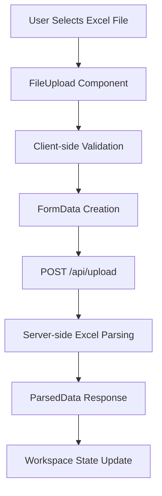
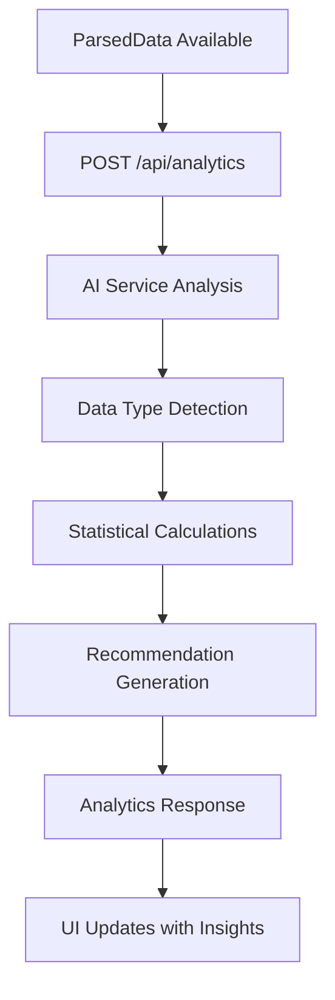
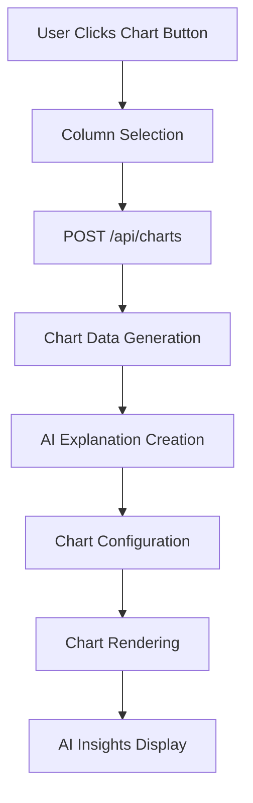

# AI Analytics Workspace - Complete System Documentation

## Table of Contents
1. [System Overview](#system-overview)
2. [Architecture](#architecture)
3. [Data Flow](#data-flow)
4. [AI Integration](#ai-integration)
5. [Component Documentation](#component-documentation)
6. [API Documentation](#api-documentation)
7. [File Processing](#file-processing)
8. [Chart Generation](#chart-generation)
9. [UI/UX Design](#uiux-design)
10. [Development Setup](#development-setup)
11. [Deployment](#deployment)
12. [Troubleshooting](#troubleshooting)

## System Overview

The AI Analytics Workspace is a Next.js 14+ application that provides intelligent data analysis and visualization capabilities for Excel files. The system combines automated data processing, AI-powered insights, and interactive chart generation to help users understand their data quickly and effectively.

### Key Features
- **Excel File Processing**: Client and server-side Excel parsing using XLSX library
- **AI-Powered Analytics**: Automated data type detection, statistical analysis, and insights generation
- **Interactive Charts**: Bar, line, and pie charts with Chart.js integration
- **Smart Recommendations**: AI-generated suggestions for data exploration
- **Real-time Explanations**: Contextual AI explanations for each visualization
- **Responsive Design**: Mobile-first design with Tailwind CSS

### Technology Stack
```json
{
  "framework": "Next.js 14+ (App Router)",
  "language": "TypeScript",
  "styling": "Tailwind CSS",
  "charts": "Chart.js + react-chartjs-2",
  "file_processing": "XLSX",
  "ui_components": "Custom components with Lucide React icons",
  "state_management": "React useState/useEffect"
}
```

## Architecture

### Project Structure
```
src/
├── app/                    # Next.js App Router
│   ├── api/               # API Routes
│   │   ├── analytics/     # Data analysis endpoint
│   │   ├── charts/        # Chart generation endpoint
│   │   └── upload/        # File upload endpoint
│   ├── workspace/         # Workspace page route
│   ├── globals.css        # Global styles
│   ├── layout.tsx         # Root layout
│   └── page.tsx          # Home page
├── components/            # React Components
│   ├── charts/           # Chart components
│   │   ├── BarChart.tsx
│   │   ├── LineChart.tsx
│   │   └── PieChart.tsx
│   ├── ui/               # UI primitives
│   │   ├── button.tsx
│   │   ├── card.tsx
│   │   └── upload.tsx
│   ├── DataTable.tsx     # Data display component
│   ├── FileUpload.tsx    # File upload component
│   └── Workspace.tsx     # Main workspace component
├── lib/                  # Utility libraries
│   ├── ai-service.ts     # AI analytics engine
│   ├── excel-parser.ts   # Excel file processing
│   └── utils.ts          # General utilities
└── types/                # TypeScript definitions
    ├── index.ts          # Main type definitions
    └── jsx.d.ts          # JSX type extensions
```

### Component Hierarchy
```
App
└── Workspace (Main Container)
    ├── FileUpload
    │   └── Upload (UI Component)
    ├── DataTable
    ├── Chart Generation Controls
    └── Chart Display Grid
        ├── BarChart
        ├── LineChart
        ├── PieChart
        └── AI Explanation Panel
```

## Data Flow

### 1. File Upload Process


### 2. Analytics Generation


### 3. Chart Generation


## AI Integration

### Core AI Service (`ai-service.ts`)

The AI service is the brain of the application, providing intelligent data analysis and insights generation.

#### Data Analysis Pipeline
```typescript
interface DataInsights {
  summary: {
    totalRows: number
    totalColumns: number
    numericColumns: string[]
    textColumns: string[]
    dateColumns: string[]
  }
  statistics: Record<string, {
    min?: number
    max?: number
    avg?: number
    sum?: number
    count: number
    uniqueValues?: number
  }>
  recommendations: string[]
}
```

#### AI Capabilities

**1. Automatic Data Type Detection**
- **Numeric Detection**: Identifies columns with >70% numeric values
- **Date Detection**: Recognizes date formats using Date.parse()
- **Text Classification**: Categorizes remaining columns as text

**2. Statistical Analysis**
- **Numeric Columns**: Min, max, average, sum, count
- **Text Columns**: Count, unique values
- **Date Columns**: Range analysis, temporal patterns

**3. Smart Recommendations**
```typescript
function generateRecommendations(numeric: string[], text: string[], date: string[]): string[] {
  const recommendations: string[] = []
  
  if (numeric.length >= 2) {
    recommendations.push(`Create scatter plots to explore relationships between ${numeric.slice(0, 2).join(' and ')}`)
  }
  
  if (numeric.length >= 1 && text.length >= 1) {
    recommendations.push(`Generate bar charts showing ${numeric[0]} by ${text[0]}`)
  }
  
  if (date.length >= 1 && numeric.length >= 1) {
    recommendations.push(`Create time series charts showing ${numeric[0]} over ${date[0]}`)
  }
  
  return recommendations
}
```

#### Chart Explanation AI

**AI-Generated Insights Structure**
```typescript
interface ChartExplanation {
  title: string
  insights: string[]        // General observations about the data
  keyFindings: string[]     // Important discoveries
  recommendations: string[] // Actionable suggestions
}
```

**Chart-Specific Analysis**

**Bar Charts**
- Distribution analysis across categories
- Performance comparison between categories
- Outlier identification
- Top/bottom performer analysis

**Line Charts**
- Trend detection (upward, downward, stable)
- Percentage change calculations
- Seasonal pattern recognition
- Growth/decline analysis

**Pie Charts**
- Proportional breakdown analysis
- Concentration analysis (top N categories)
- Distribution balance assessment
- Market share insights

**AI Analysis Examples**
```typescript
// Trend Detection for Line Charts
const firstHalf = values.slice(0, Math.floor(values.length / 2))
const secondHalf = values.slice(Math.floor(values.length / 2))
const firstAvg = firstHalf.reduce((sum, val) => sum + val, 0) / firstHalf.length
const secondAvg = secondHalf.reduce((sum, val) => sum + val, 0) / secondHalf.length

if (secondAvg > firstAvg * 1.1) {
  keyFindings.push(`There's an upward trend with values increasing by ${((secondAvg / firstAvg - 1) * 100).toFixed(1)}%.`)
}
```

## Component Documentation

### Workspace Component (`Workspace.tsx`)

**Purpose**: Main orchestrator component managing the entire application state and user interactions.

**State Management**
```typescript
const [data, setData] = useState<ParsedData | null>(null)           // Parsed Excel data
const [analytics, setAnalytics] = useState<AnalyticsResult | null>(null) // Analytics results
const [insights, setInsights] = useState<DataInsights | null>(null)      // AI insights
const [charts, setCharts] = useState<ChartConfig[]>([])                  // Generated charts
const [loading, setLoading] = useState(false)                           // Loading state
const [generatingChart, setGeneratingChart] = useState<string | null>(null) // Chart generation state
```

**Key Methods**
- `handleDataParsed()`: Processes uploaded data and triggers analytics
- `generateChart()`: Creates new charts with AI explanations
- `removeChart()`: Removes charts from the display
- `renderChart()`: Renders appropriate chart component based on type

### FileUpload Component (`FileUpload.tsx`)

**Purpose**: Handles Excel file selection, validation, and upload to the server.

**Features**
- File type validation (Excel formats)
- File size display with human-readable formatting
- Upload progress indication
- Error handling and user feedback

**Upload Process**
```typescript
const handleUpload = async () => {
  const formData = new FormData()
  formData.append('file', file)
  
  const response = await fetch('/api/upload', {
    method: 'POST',
    body: formData,
  })
  
  const result = await response.json()
  if (onDataParsed && result.data) {
    onDataParsed(result.data)
  }
}
```

### Chart Components

**BarChart Component (`BarChart.tsx`)**
```typescript
const options = {
  responsive: true,
  plugins: {
    legend: { position: 'top' as const },
    title: { display: !!title, text: title }
  },
  scales: {
    y: { beginAtZero: true }
  }
}
```

**Common Chart Features**
- Responsive design with fixed height (384px)
- Consistent styling and color schemes
- Chart.js integration with proper registration
- Title and legend support

### DataTable Component (`DataTable.tsx`)

**Purpose**: Displays parsed Excel data in a paginated, scrollable table format.

**Features**
- Horizontal scrolling for wide datasets
- Row limiting (default 100 rows) for performance
- Hover effects and clean styling
- Empty state handling

## API Documentation

### POST /api/upload

**Purpose**: Handles Excel file upload and parsing

**Request**
```typescript
Content-Type: multipart/form-data
Body: FormData with 'file' field containing Excel file
```

**Response**
```typescript
{
  success: boolean
  data?: ParsedData
  error?: string
}
```

**Processing Flow**
1. File validation and size checking
2. Server-side Excel parsing using XLSX
3. Data structure conversion
4. Metadata extraction

### POST /api/analytics

**Purpose**: Generates AI-powered analytics and insights

**Request**
```typescript
{
  data: ParsedData
}
```

**Response**
```typescript
{
  success: boolean
  analytics: AnalyticsResult
  insights: DataInsights
  error?: string
}
```

**Processing**
1. Data type detection and categorization
2. Statistical analysis for each column
3. Smart recommendation generation
4. Summary statistics compilation

### POST /api/charts

**Purpose**: Generates chart data and AI explanations

**Request**
```typescript
{
  chartType: 'bar' | 'line' | 'pie'
  data: ParsedData
  xColumn: string
  yColumn: string
}
```

**Response**
```typescript
{
  success: boolean
  chartData: ChartData
  chartType: string
  explanation: ChartExplanation
  error?: string
}
```

**Processing**
1. Data aggregation and transformation
2. Chart.js compatible data structure creation
3. AI explanation generation
4. Color scheme application

## File Processing

### Excel Parser (`excel-parser.ts`)

**Dual Environment Support**
- **Client-side**: `parseExcelClient()` for browser file processing
- **Server-side**: `parseExcelServer()` for API route processing

**Parsing Process**
```typescript
export interface ParsedData {
  headers: string[]           // Column headers from first row
  rows: any[][]              // Data rows (2D array)
  sheetNames: string[]       // Available sheet names
  metadata: {
    totalRows: number        // Number of data rows
    totalColumns: number     // Number of columns
    fileName?: string        // Original file name
  }
}
```

**Error Handling**
- Empty spreadsheet detection
- File format validation
- Corrupted file handling
- Memory management for large files

## Chart Generation

### Chart Data Transformation

**Data Aggregation Process**
```typescript
export function generateChartData(
  data: ParsedData, 
  chartType: 'bar' | 'line' | 'pie', 
  xColumn: string, 
  yColumn: string
): ChartData {
  const chartData: Record<string, number> = {}
  
  data.rows.forEach(row => {
    const xVal = String(row[xIndex] || 'Unknown')
    const yVal = Number(row[yIndex]) || 0
    
    chartData[xVal] = (chartData[xVal] || 0) + yVal
  })
  
  return {
    labels: Object.keys(chartData),
    datasets: [{
      label: yColumn,
      data: Object.values(chartData),
      backgroundColor: generateColors(labels.length)
    }]
  }
}
```

**Color Generation**
```typescript
function generateColors(count: number): string[] {
  const colors = [
    '#3B82F6', '#EF4444', '#10B981', '#F59E0B', '#8B5CF6',
    '#06B6D4', '#F97316', '#84CC16', '#EC4899', '#6366F1'
  ]
  
  return Array.from({ length: count }, (_, i) => colors[i % colors.length])
}
```

### Chart Configuration Management

**Chart State Structure**
```typescript
interface ChartConfig {
  id: string                    // Unique identifier
  type: string                  // Chart type (bar, line, pie)
  data: ChartData              // Chart.js data structure
  title: string                // Display title
  explanation?: ChartExplanation // AI-generated insights
}
```

## UI/UX Design

### Design System

**Color Palette**
```css
/* Primary Colors */
--blue-50: #eff6ff;
--blue-500: #3b82f6;
--blue-600: #2563eb;
--blue-900: #1e3a8a;

/* Success Colors */
--green-50: #f0fdf4;
--green-500: #22c55e;
--green-600: #16a34a;

/* Warning Colors */
--amber-500: #f59e0b;

/* Error Colors */
--red-50: #fef2f2;
--red-500: #ef4444;
```

**Typography Scale**
- Headings: `text-3xl`, `text-xl` with `font-bold`/`font-semibold`
- Body: `text-sm`, `text-base` with appropriate line heights
- Captions: `text-xs` for metadata and secondary information

**Spacing System**
- Container: `max-w-7xl mx-auto p-6`
- Component spacing: `space-y-8`, `space-y-6`, `space-y-4`
- Grid layouts: `grid-cols-1 md:grid-cols-3 gap-4`

### Responsive Design

**Breakpoint Strategy**
```css
/* Mobile First Approach */
.grid-cols-1              /* Base: Single column */
.md:grid-cols-3           /* Medium: Three columns */
.lg:grid-cols-2           /* Large: Two columns for charts */
```

**Component Responsiveness**
- Charts: Fixed height (384px) with responsive width
- Tables: Horizontal scroll on overflow
- Cards: Flexible padding and margins
- Navigation: Collapsible on mobile

### Loading States

**Loading Indicators**
```typescript
// Spinner Component
<div className="animate-spin rounded-full h-8 w-8 border-b-2 border-blue-600 mx-auto"></div>

// Button Loading State
{generatingChart === "bar" && (
  <div className="absolute inset-0 flex items-center justify-center">
    <div className="animate-spin rounded-full h-4 w-4 border-b-2 border-blue-600"></div>
  </div>
)}
```

**Progressive Enhancement**
- Immediate feedback for user actions
- Skeleton loading for data tables
- Smooth transitions between states
- Error boundaries for graceful failures

## Development Setup

### Prerequisites
```bash
Node.js >= 18.0.0
npm or yarn package manager
```

### Installation
```bash
# Clone repository
git clone <repository-url>
cd ai-analytics-workspace

# Install dependencies
npm install
# or
yarn install

# Start development server
npm run dev
# or
yarn dev
```

### Environment Configuration
```bash
# .env.local (if needed for external APIs)
NEXT_PUBLIC_API_URL=http://localhost:3000
```

### Development Scripts
```json
{
  "dev": "next dev",           // Development server
  "build": "next build",       // Production build
  "start": "next start",       // Production server
  "lint": "eslint ."          // Code linting
}
```

## Deployment

### Build Process
```bash
# Create production build
npm run build

# Start production server
npm run start
```

### Deployment Platforms

**Vercel (Recommended)**
```bash
# Install Vercel CLI
npm i -g vercel

# Deploy
vercel --prod
```

**Docker Deployment**
```dockerfile
FROM node:18-alpine
WORKDIR /app
COPY package*.json ./
RUN npm ci --only=production
COPY . .
RUN npm run build
EXPOSE 3000
CMD ["npm", "start"]
```

### Performance Optimization

**Bundle Analysis**
```bash
# Analyze bundle size
npm install --save-dev @next/bundle-analyzer
```

**Image Optimization**
- Use Next.js Image component for static assets
- Implement lazy loading for chart components
- Optimize Excel file processing for large datasets

## Troubleshooting

### Common Issues

**1. Excel File Parsing Errors**
```typescript
// Error: "Failed to parse Excel file"
// Solution: Validate file format and size
if (!file.name.match(/\.(xlsx|xls)$/)) {
  throw new Error('Please upload a valid Excel file (.xlsx or .xls)')
}
```

**2. Chart Rendering Issues**
```typescript
// Error: Chart not displaying
// Solution: Ensure Chart.js components are properly registered
import {
  Chart as ChartJS,
  CategoryScale,
  LinearScale,
  BarElement,
  Title,
  Tooltip,
  Legend,
} from 'chart.js'

ChartJS.register(CategoryScale, LinearScale, BarElement, Title, Tooltip, Legend)
```

**3. Memory Issues with Large Files**
```typescript
// Solution: Implement file size limits and streaming
const MAX_FILE_SIZE = 10 * 1024 * 1024 // 10MB
if (file.size > MAX_FILE_SIZE) {
  throw new Error('File size exceeds 10MB limit')
}
```

### Debug Tools

**React DevTools**
- Component state inspection
- Performance profiling
- Hook debugging

**Network Tab**
- API request monitoring
- File upload progress
- Error response analysis

**Console Logging**
```typescript
// Development logging
if (process.env.NODE_ENV === 'development') {
  console.log('Chart data:', chartData)
  console.log('AI insights:', insights)
}
```

### Performance Monitoring

**Key Metrics**
- File upload time
- Chart generation speed
- AI analysis duration
- Memory usage for large datasets

**Optimization Strategies**
- Implement data pagination for large tables
- Use React.memo for expensive chart components
- Debounce user interactions
- Lazy load chart libraries

---

This documentation provides a comprehensive overview of the AI Analytics Workspace system, covering all aspects from architecture to deployment. The system successfully combines modern web technologies with AI-powered analytics to create an intuitive and powerful data analysis tool.